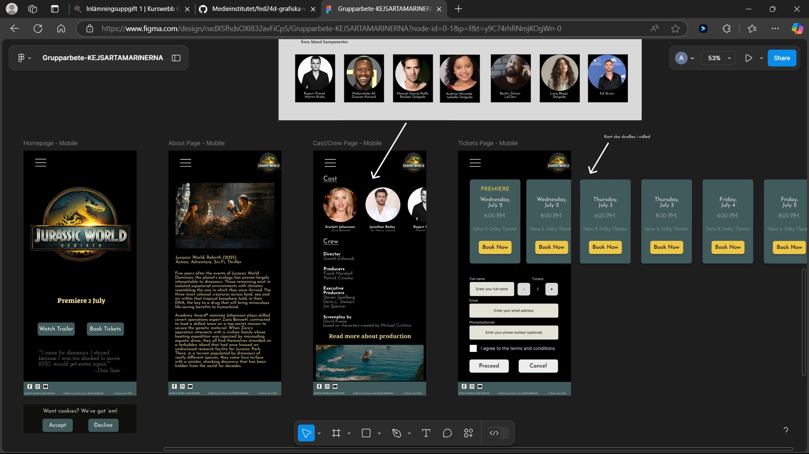

# Design Swap
### A fictional premiere page for "Jurassic World Rebirth"

Welcome to "Design-Swap, an assignment we did while studying the Front End Developer Program at Mediainstitutet. In this project we got handed a desing from another group and coded the website acording to their vision. It was also for many of us the first time using Vue and we learned alot about the challenges of creating and handing over a design.  
The website we got handed was for a movie premiere where you can read about film and order tickets. Have a look!

## 🚀 About Us

We are a group of students at the Front End Development program at Medieinstitutet.

**Authors & Coders:** Mikaela Kihl, Catrin Törnqvist, David Kjellstrand & Oskar Lundberg  
*Kubakrokodilerna*

**Designers:** Anna Biehl, Antonina Dulama, Ludvig Nyåker & Sokol Hatija  
*Kejsartamarinerna*

## 🔗 Links

[Github Repositorie](https://github.com/Medieinstitutet/fed24d-arbetsmetodik-inl-1-Davkje/)

[Github Pages](https://medieinstitutet.github.io/fed24d-arbetsmetodik-inl-1-Davkje/) - *Live version of the project*

## Tech Stack

**Languages:** TypeScript, HTML, CSS (Sass)  

**Framework:** Vue  

**Build Tool:** Vite  

**Dependencies:**  
- ESLint (with Vue & TypeScript configs)  
- Prettier (with Vue integration)  
- Sass (SCSS compiler)  
- Vue TSC (TypeScript type checking) 

<br/>

[](https://skillicons.dev)

## Preview


## Design



## Features

- Multi-page navigation with Vue Router
- Responsive design
- SCSS styling
- Interactive booking form
- Home, About, Ticket & Cast page

## Studied Topics

- Vue
- Design Tools (Figma)
- Color Theory
- Typography
- Accessibility
- Fileformats (SVG etc.)


## Project Setup

```sh
pnpm install
```

### Compile and Hot-Reload for Development

```sh
pnpm dev
```

### Type-Check, Compile and Minify for Production

```sh
pnpm build
```

### Lint with [ESLint](https://eslint.org/)

```sh
pnpm lint
```
